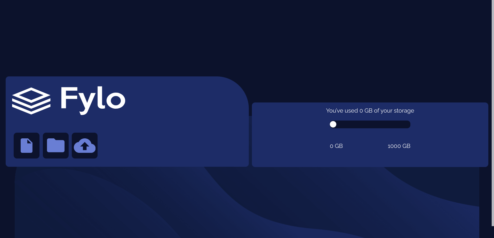

# Frontend Mentor - Fylo data storage component solution

This is a solution to the [Fylo data storage component challenge on Frontend Mentor](https://www.frontendmentor.io/challenges/fylo-data-storage-component-1dZPRbV5n). Frontend Mentor challenges help you improve your coding skills by building realistic projects. 

## Table of contents

- [Overview](#overview)
  - [The challenge](#the-challenge)
  - [Screenshot](#screenshot)
  - [Links](#links)
- [My process](#my-process)
  - [Built with](#built-with)
  - [What I learned](#what-i-learned)
  - [Continued development](#continued-development)
  - [Useful resources](#useful-resources)

## Overview

### The challenge

Users should be able to:

- View the optimal layout for the site depending on their device's screen size

### Screenshot

### Links

- Live Site URL: [Github Pages](https://jdegand.github.io/fylo-data-storage-component/)

## My process

### Built with

- CSS custom properties
- Flexbox

### What I learned

### Continued development

- Semantic HTML
- Can only drag the slider backwards since a click event is not being handled.
- (Mobile) The higher the progress the more the bar covers the thumb of the slider til you can't see it or easily grab it 
- Margin on the thumb is very noticeable on desktop

### Useful resources

- [W3 Schools](https://www.w3schools.com/howto/howto_js_rangeslider.asp) - Range slider
